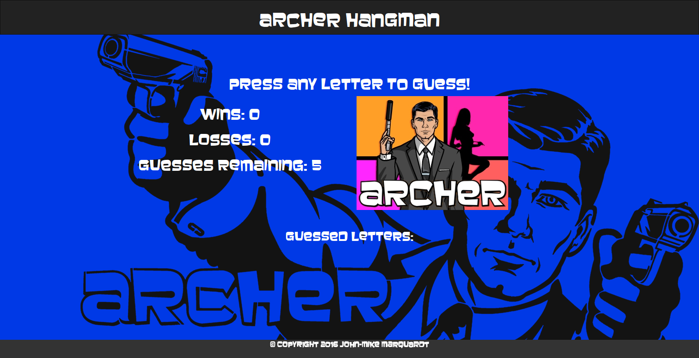

# Archer Hangman
## Description
Hangman game, using HTML, CSS and JavaScript only. This was completed in the third week of the UNC Coding Bootcamp. This project was limited only to the level of coding we learned this week (introductory JavaScript).

## Screenshot

## Technologies used
* HTML
* CSS
* JavaScript

## Built with:
* Sublime
* Baveuse font

## Future Improvements
* better style
* timers

## Author
John-Mike Marquardt @codemarq